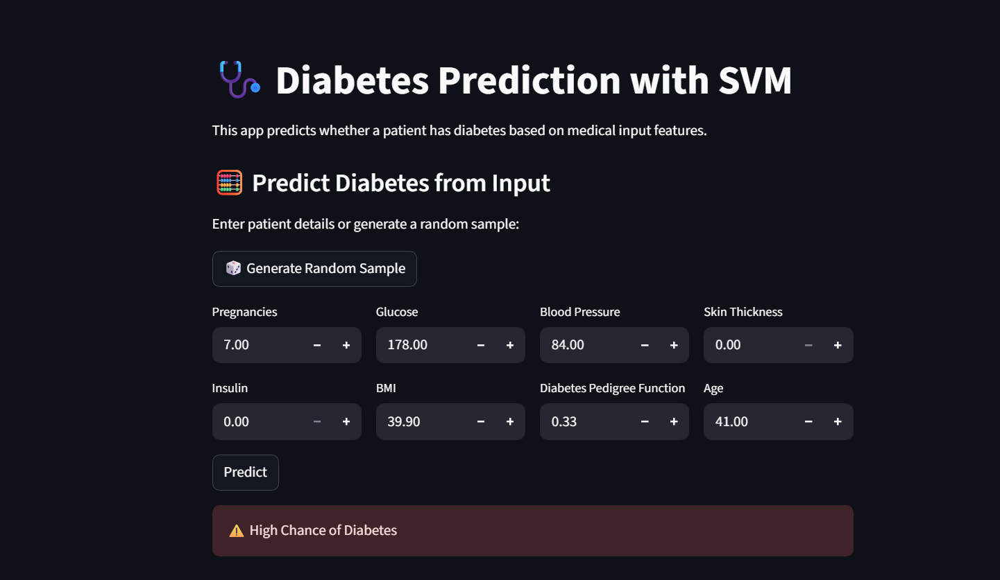
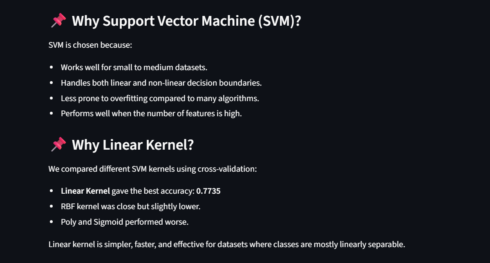
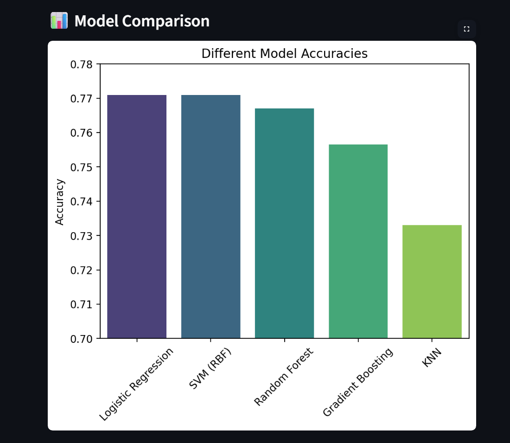
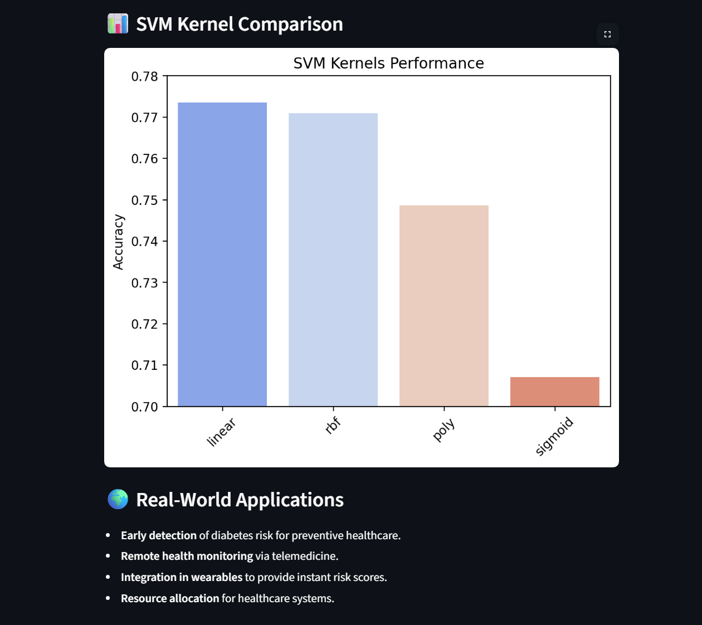

# 🩺 Diabetes Prediction - https://kanav-diabetes-prediction.streamlit.app/

This project is a **machine learning classification model** that predicts whether a person is **diabetic** or **non-diabetic** based on various health parameters.

## 📌 Project Overview

Using the **PIMA Indians Diabetes Dataset**, this model learns from different medical attributes to classify individuals into:

* **Diabetic (1)**
* **Non-Diabetic (0)**

We experimented with multiple classification algorithms (Logistic Regression, Random Forest, KNN, etc.) and found that **SVM with a linear kernel** gave the best balance of performance and simplicity for this dataset.



## 🚀 Features

* **Interactive Web App** built with Streamlit.
* **Random Sample Generator** that produces:

  * First click → a near-real diabetic sample from dataset.
  * Second click → a near-real non-diabetic sample.
* **Data Visualization** using Seaborn.
* Real-time prediction for custom user-provided values.



## 🛠 Technologies Used

* **Python 3**
* **Pandas, NumPy** for data handling.
* **Scikit-learn** for SVM and other classification models.
* **Streamlit** for the web-based interface.
* **Seaborn** for visualizations.

## 📊 Model Details

* **Algorithm:** Support Vector Machine (SVM) with **linear kernel**
* **Accuracy:** \~77% (may vary depending on random state and data split)
* **Target:** 1 → Diabetic, 0 → Non-Diabetic





## 📈 How It Works

1. The dataset is loaded and preprocessed.
2. Multiple classification models are trained and evaluated.
3. **SVM (Linear Kernel)** is used for final predictions.
4. The Streamlit app allows users to:

   * Enter medical values manually.
   * Generate random diabetic or non-diabetic samples from the dataset.
   * Instantly get predictions.

## 💡 Real-World Applications

* **Early Detection**: Helps identify potential diabetes risk for early medical intervention.
* **Medical Research**: Useful in healthcare analytics and medical decision support.
* **Health Checkup Camps**: Can be deployed for instant screening in public health initiatives.

## ▶️ How to Run

1. Clone the repository:

   ```bash
   git clone https://github.com/Kanav-Chauhan/Diabetes-Prediction.git
   ```
2. Open the folder:

   ```bash
   cd Diabetes-Prediction
   ```
3. Install Dependencies:

   ```bash
   pip install -r requirements.txt
   ```
4. Run the app:

   ```bash
   streamlit run app.py
   ```

---

# Made with ❤️ by Kanav Chauhan
